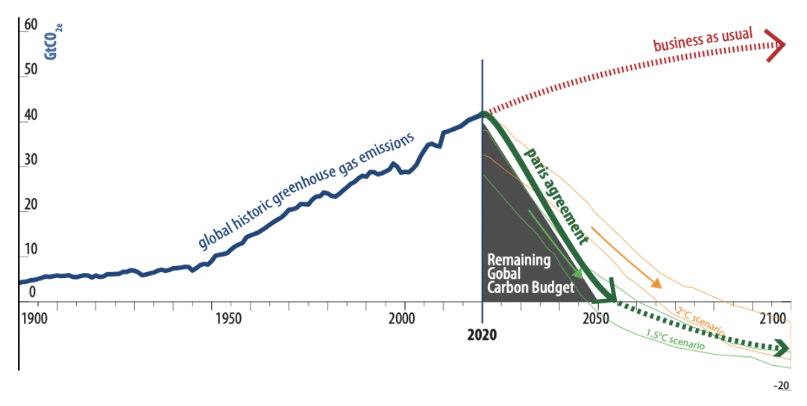
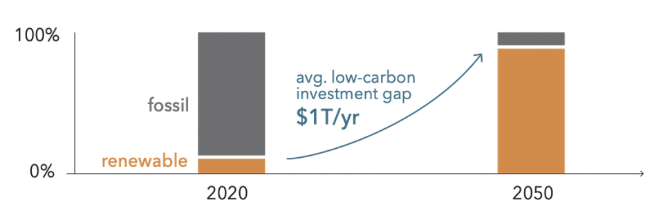

# About

### Problem

The Paris Agreement of 2016 mandated that global impact due to CO2 emissions be kept below 1.5 degrees C to avoid irrecoverable damage to the Earth. Inline with this, by 2050, the world needs to achieve a net zero carbon emission state. The transition to renewable energy is accelerating but the problem is that its still not on pace to meet this global target.

Solar energy is now affordable and increasingly accepted as a viable alternative to legacy energy systems. It's also a solid generator of jobs. A radical roll-out of solar energy will occur both from traditional utility-scale projects, but most important by a huge aggregation of small and medium sized projects. The large capital flows needed for the energy transition need to be able to reach directly to the decentralized small and medium scale projects.

There are many options for financing solar energy, particularly in the USA. However, the underlying contractual frameworks to finance renewable energy are not fit for the purpose of a radical mobilization of capital to achieve global goals. Most long-term power purchase agreements \(PPA\), lease-to-own models and the procedures to capture the associated investment tax benefits and green attribute credits are cumbersome and require economies of scale to be affordable.

Furthermore, the industry lacks a common platform and standard to seamlessly integrate a full array of investors— overseas, institutional, public and private— with beneficiaries using accessible debt and equity securities. To the energy finance world “there is more money available than there are projects.” In part, this is due to the cumbersome legal pipeline that developers must navigate from project inception to capitalization. The result leave the needed decentralized community projects will little access to capital.

This is the problem Opensolar aims to solve by providing a platform that leverages distributed ledger technology and IoT driven smart contracts for contractual automation in financial processes to drive community owned solar projects.

