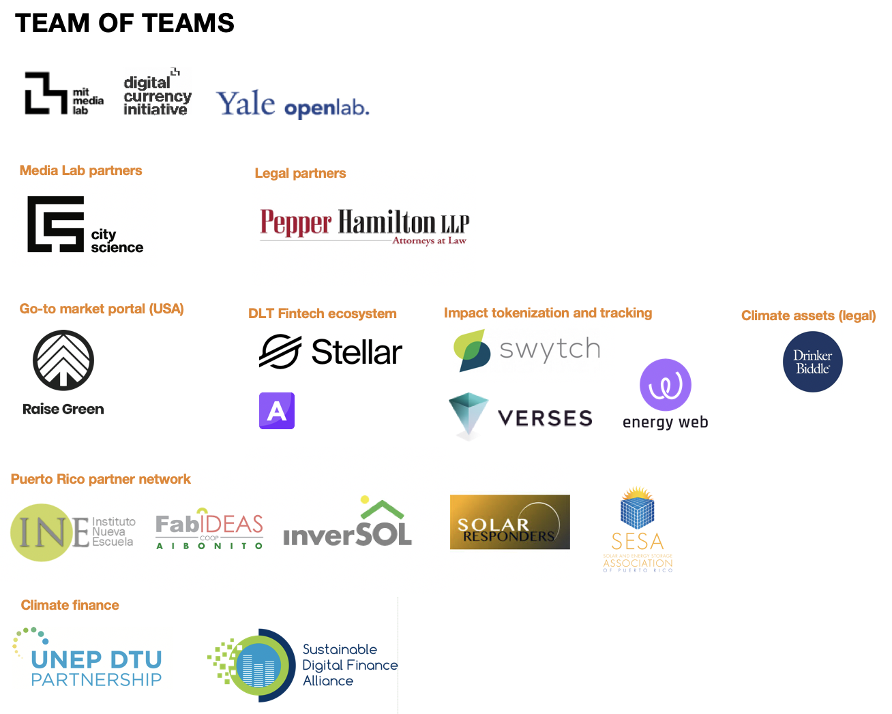

# People

## People

Martin E. Wainstein, PhD - Founder and Lead Scientist, Yale Openlab ; Resident and fellow, Center for Business & the Environment at Yale. Email: martin.wainstein@yale.edu

Varunram Ganesh - Blockchain developer, MIT Digital Currency Initiative. Email: ganeshv@mit.edu

### Advisors

Neha Narula, PhD - Director, MIT Digital Currency Initiative

Michael Casey - Senior Advisor, MIT Digital Currency Initiative

## Partner Network

The open solar project has developed a large network of collaborators that have participated in the project throughout the last two years. These include MIT and Yale students \(ongoing and alumni\), Yale and MIT professors, as well as a growing network of startups, large companies and grassroots community in Puerto Rico that actively supports and participates in the project.

