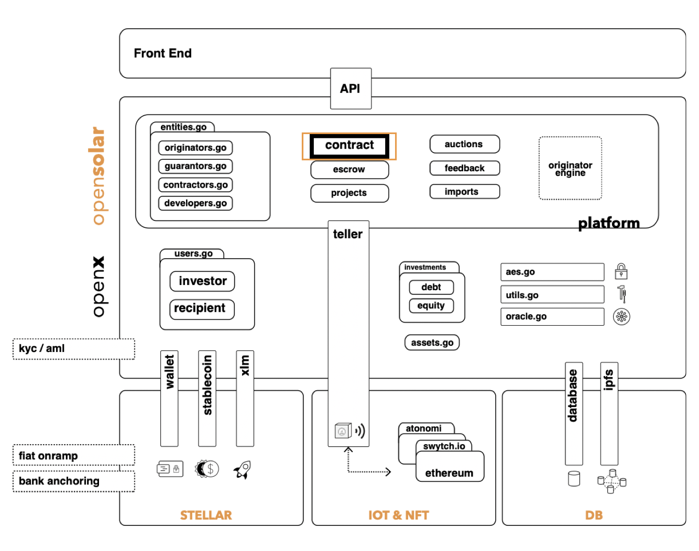

# Architecture

Openx is meant to be a broader platform infrastructure which can accommodate a wide variety of platforms. Opensolar is one of the platforms based on openx. Platforms need to obtain a special token in order to call endpoints that are reserved for platforms \(the platform-platform API\). These endpoints allow a caller platform to import openx user data, user KYC data, their balances on different blockchains, and more. Communication between openx and opensolar is through the JSON-RPC APIs of openx.

Opensolar was designed to showcase the functionality of openx in the solar energy context. It serves as an example to show how platforms can build on openx.

