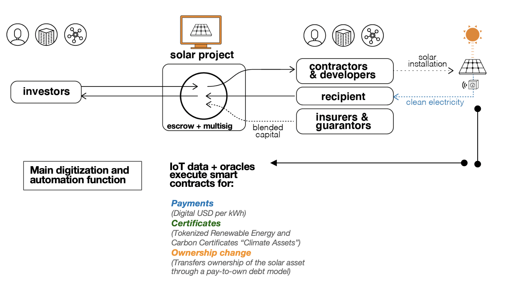

# Blockchain

Opensolar \(like openx\) uses Stellar, a Proof of Stake blockchain based on the Stellar Consensus Protocol. Stellar follows an account based model of accounting in which balances are associated with a public key \("account" or "address"\) on the blockchain, and subsequent operations increase the balance associated with the address. Stellar provides a set of operations that can be performed globally to change the state of a set of addresses \([https://www.stellar.org/developers/guides/concepts/list-of-operations.html](https://www.stellar.org/developers/guides/concepts/list-of-operations.html)\)

Stellar's blockchain interface has two components:

* [Stellar-core](https://github.com/stellar/stellar-core): Stellar core is the blockchain client that communicates with other nodes and takes part in the Stellar Consensus Protocol.
* [Horizon](https://godoc.org/github.com/stellar/go/clients/horizon): Horizon is the API instance of stellar-core used to interact with the blockchain.

Openx right now connects to the Stellar Development Foundation's Horizon instances, although an openx platform can choose to run its own node or connect to other Horizon instances. This however, does not provide much additional censorship resistance since the quorum that the Stellar Consensus Protocol depends on for consensus relies by default on the SDF nodes, and most nodes on Stellar follow stellar-core's default configuration.

Stellar is a Proof of Stake blockchain following the Stellar Consensus Protocol. Stellar uses an account based model of accounting where balances are associated with a public key \("account" or "address"\) on the blockchain and subsequent operations increase the balance and sequence number associated with the address. Stellar provides a set of operations that can be performed globally to change the state of a set of addresses \([https://www.stellar.org/developers/guides/concepts/list-of-operations.html](https://www.stellar.org/developers/guides/concepts/list-of-operations.html)\). The list of operations used by Opensolar are:

* **Create Account**: To create user accounts
* **Payment**: To move funds between different accounts on Stellar
* **Buy Offer**: To exchange XLM with other currencies on the Stellar Decentralised Exchange \(DEX\) \(buy\)
* **Sell Offer**: To exchange XLM and other currencies on the Stellar DEX \(sell\)
* **Set Options**: To set thresholds for different signers associated with an account. Used for providing multisig and escrow functionality.
* **Change Trust**: To change the trust associated with signers associated with an account. Used for providing multisig and escrow functionality.

The issuance of assets is a feature that can replicate the function of a global state variable \([https://www.stellar.org/developers/guides/concepts/assets.html](https://www.stellar.org/developers/guides/concepts/assets.html)\) on Stellar. Each asset has an issuer who can issue a limited or unlimited amount of assets \(set by the "Set Options" operation\), and a receiver who trusts the issuer for the asset.

Assets are not trustless, and the receiver trusts the issuer for the asset they receive \(an example is a bank - one trusts a bank to give valid currency when withdrawing cash\). A receiver specifies a limit called the "Trust Limit", which is the maximum amount of assets they can receive from the issuer. This limit can be increased or decreased.

In opensolar, two kinds of assets are used:

1. Receiver Assets: Receivers receive two assets - "DebtAsset" and "PaybackAsset". The Debt Asset is 1:1 with the net returns associated with a project and each time a payment is made towards a project, DebtAssets are transferred from a receiver to the platform's address. The PaybackAsset is used to track the number of months to full ownership of an installed project. It is also transferred from the receiver to the platform's address with each successful payment.
2. Investor Assets: The Investor asset \("INVAsset"\) is 1:1 with the amount they invest in the project \(ie if an investor invests $1000 in the platform, they get 1000 INVAssets\). This ratio scales with the risk and stage of investment \(for example, seed investors may get 1:1.3 for the additional risk they take in providing early capital\)

Opensolar has its own account on the blockchain that acts as a pre-escrow for listed projects. When a project doesn't reach its targeted funding goal or is cancelled, the platform refunds the investors for the amount invested. Opensolar can also act as an arbiter if project terms change without prior notification to or without approval of investors, and if investors raise a claim with the platform.

Opensolar acts as one of the signers of a multi-signature escrow account for funded projects, and every time a receiver wants to withdraw funds \(for example, to pay contractors\), they need to request approval from the platform. To prevent withdrawal delays, the platform signs all transactions by default.

