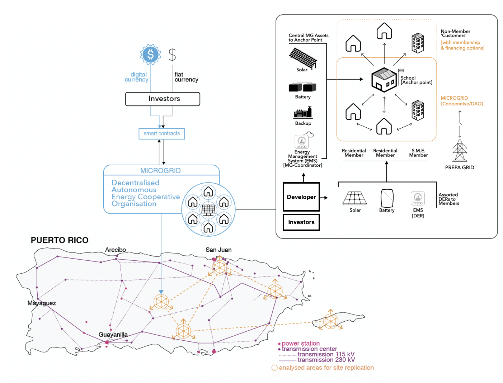
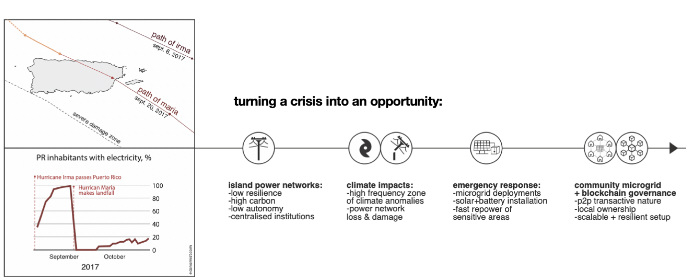

# Puerto Rico

One year after hurricane Maria hit the island, schools and first responders are still exposed to a centralized and high-carbon energy system vulnerable to climate impacts. At the same time, schools are becoming "grass root community centres" facilitating discussions among concerned parents on how to increase climate & social resilience.

An informal solar energy economy has developed across the island due to the need to have a backup source of energy and also to avoid increasing energy costs imposed by the Puerto Rico Electric Power Authority \(PREPA\) \(Puerto Rico’s electricity tariff is one of the highest in the US at $0.25/kWh\). Large solar players still offer the outdated 20 year Power Purchase Agreement \(PPA\) contract but Puerto Ricans resist being tied to long-term agreements without ownership. This provides a prime opportunity for piloting a platform which can both offer investments without having to deal with extensive bureaucracy and provide ownership of the system, leading to a local push towards green energy.

The pilot project entails the installation of a 5kW system with InverSol’s Lumen battery and inverter unit. Solar will power critical loads in the building including emergency lights, a telecommunication system, and main manufacturing equipment.

### Entities

The installed system is priced at **$12000**, with **$9000** being donated by **Council Rock / InverSol** to support the pilot and coop. The **Digital Currency Initiative at the MIT Media Lab** will provide a grant of $4000 to cover $3000 of labor cost by the inverSol team and $1000 of other installation services. The FabIDEAS Coop has agreed to match this $4000 by paying for the solar electricity at the standard utility price \(which the building is subject to when it purchases power from the grid\). Once funds accrue they will be reinvested in manufacturing units for the Fab Lab.

