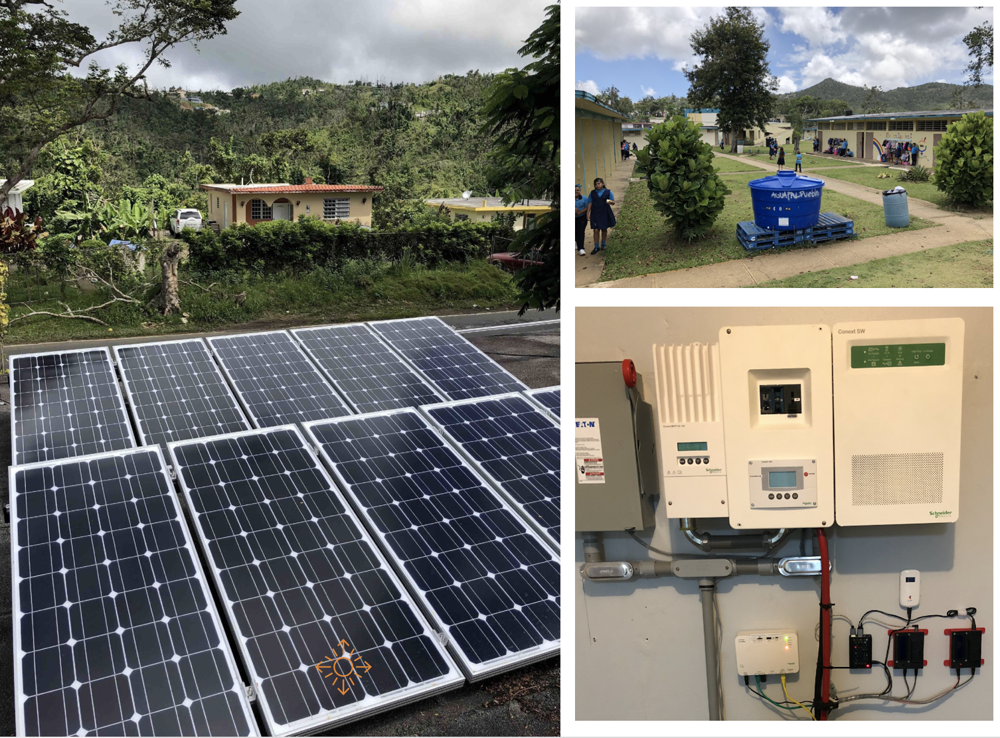

# Details

The solar installation will be a behind-the-meter backup setup, to avoid net metering with PREPA’s grid. Future expansion deployments could consider a grid-tied two-way system. The 5kW solar photovoltaics will be installed on the FabIDEAS main building’s roof and connected to the inverSOL’s Lumen unit equipped with a 5kWh battery, a 5kW inverter, a charge regulator and internet-of-things \(IoT\) functionality.

This 10 kW system was installed in a Grid-Tied design by CT solar Developers. It has a 15 kW smart solarEdge inverter, and an Itron revenue grade REC meter. The system is roof-mounted on a 55 degree angle on a SE facing view. However, its high efficient Jingko panels provide a 78% efficiency rating.

### Installation Archetype

This will be a model installation in that the solar and battery support a subpanel of the building circuitry, where only critical loads have been connected. Large manufacturing machinery will not be connected to the subpanel. The system will be configured as a grid-tied installation, in that the main grid can also support other loads in the panel as well as be used to power the battery bank. The installation allows for the interconnection of an emergency generator if needed

### IT Infrastructure

Main power data readings will come directly from the Lumen all-in-one powermeter unit, transmitting secure data via MQTT protocol. A second revenue-grade meter with IoT pre-pay functionality will be added for further testing integrations. IoT readings from the Lumen system will be used in a smart contract oracle to verify & validate readings for payment and REC generation. A whole building non-invasive powermeter is also contemplated to critical vs. general loads.

