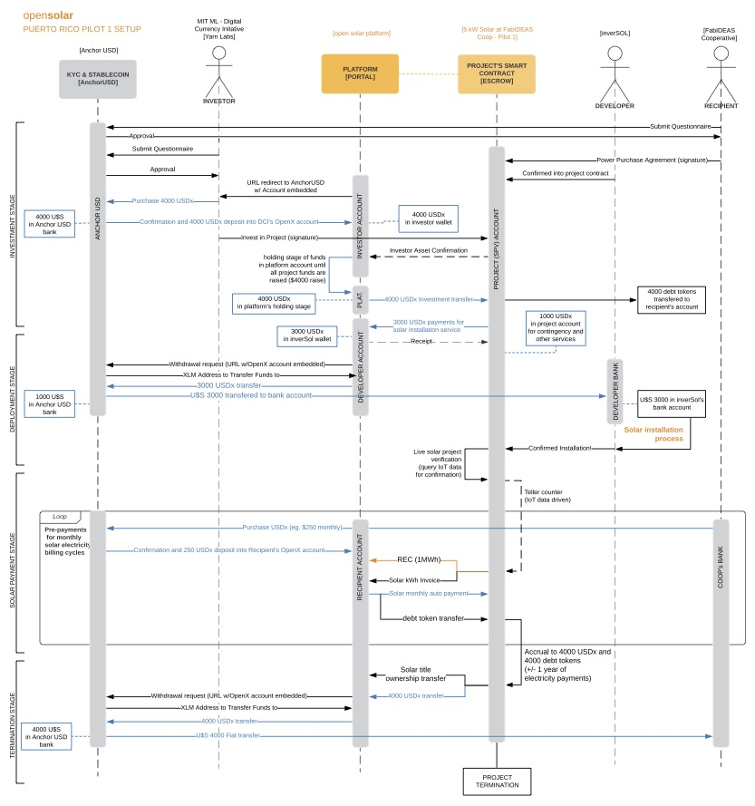

# Details

The solar installation will be a behind-the-meter backup setup, to avoid net metering with PREPA’s grid. Future deployments could consider a grid-tied two-way system. The 5kW solar photovoltaics will be installed on the FabIDEAS main building’s roof and connected to inverSOL’s internet-of-things \(IoT\) enabled Lumen unit equipped with a 5kWh battery, a 5kW inverter and a charge regulator.

This system was installed in a Grid-Tied design by CT Solar Developers. It has a 15 kW smart solarEdge inverter, and a revenue grade Itron REC meter. The system is roof-mounted at a 55 degree angle facing the South East direction. Its highly efficient \(Jinko\) panels provide a 78% efficiency rating.

### Installation Archetype

This is a model installation where the solar panels and battery support a subpanel of the building circuitry supporting critical loads. Large manufacturing machinery is not connected to the subpanel. The system is configured as a grid-tied installation, and the main grid can support other loads in the panel and also be used to power the battery. The installation allows for the interconnection of an emergency generator.

### IT Infrastructure

Main power data readings will come directly from the Lumen unit via the MQTT protocol. A second revenue-grade meter with IoT pre-pay functionality will be added for further integration testing. IoT readings from the Lumen system will be used with a smart contract oracle to verify & validate readings for payment and REC generation. A whole building non-invasive powermeter is also contemplated for future installation.

### Initial Setup - Interaction Diagram

